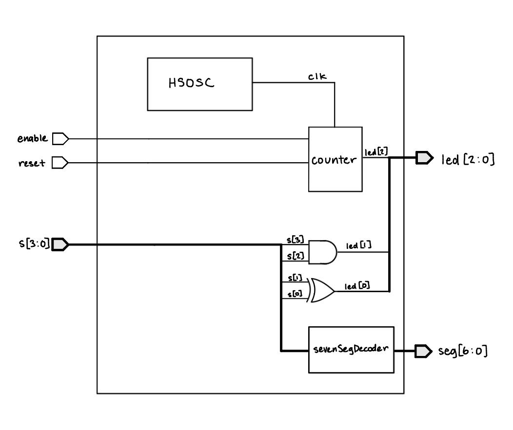
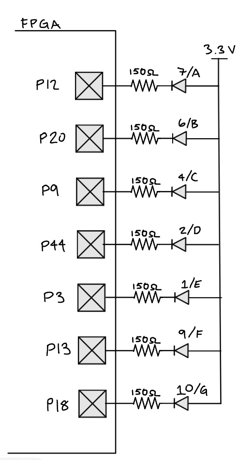
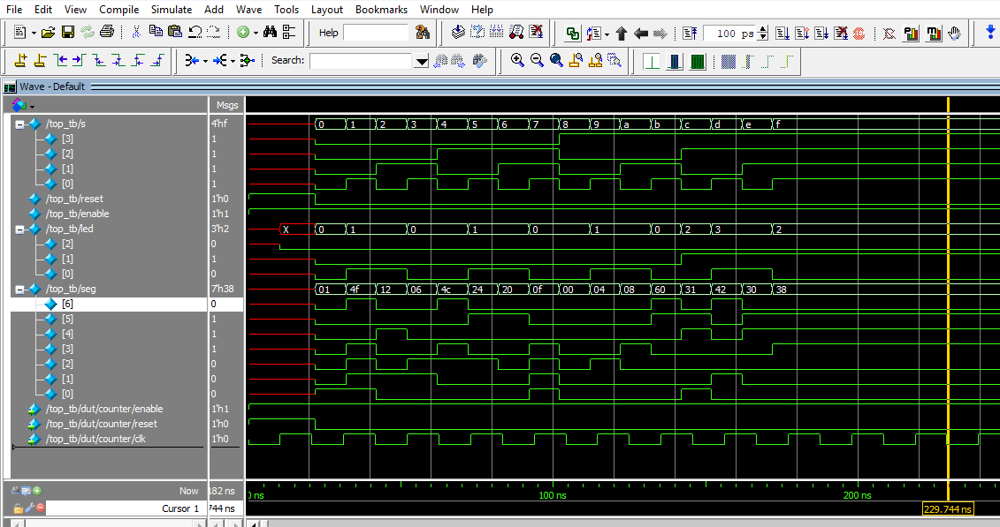
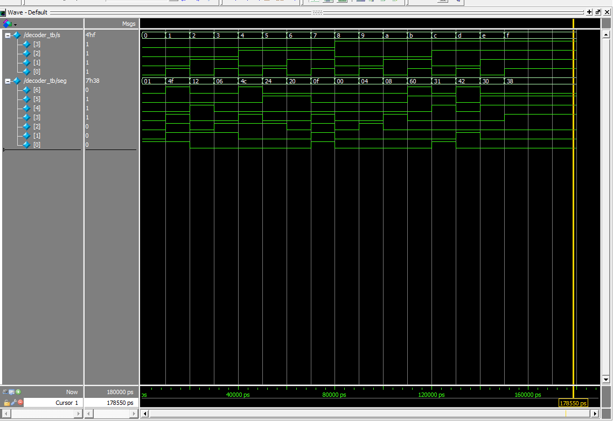
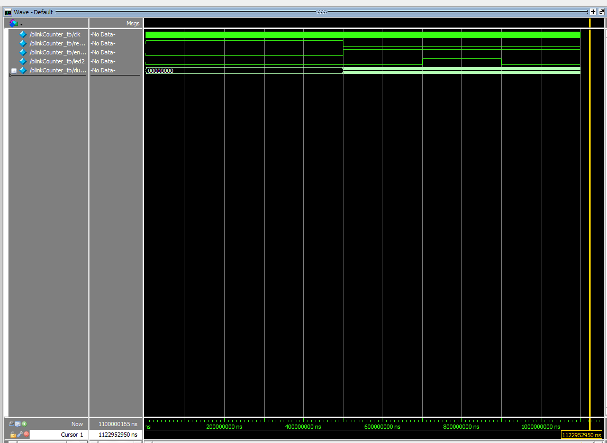

## Introduction
In this lab, a design was implemented on the FPGA to program a seven segment display, to show hexadecimal digits from 0 to F given a binary input. Two LEDs were also programmed with set logic given the input, and a third LED was programmed to blink at 2.4 Hz.

## Design and Testing Methodology
### Design Overview
The first step in the design was to determine the logic needed for the first two LEDs which resulted in a XOR gate and an AND gate. The third blinking LED utilized the on-board high-speed oscillator to generate a 48 MHz clock signal, then a counter was used at a cycle of 20000000 to generate a 2.4 Hz blinking frequency. 

The second part of the design included the 7 segment display decoder module that mapped the binary input to the segments of the display that needed to be illuminated to display the correct hexadecimal digit.

## Technical Documentation
The source code for the project can be found in the associated [Github repository](https://github.com/isabella-vera/E155/tree/main/Lab1)

### Block Diagram


### Schematic


### Resistor Calculations
To determine the appropriate resistor values, I used the forward voltage and current ratings from the 7-segment display datasheet. From the datasheet, I found that the voltage drop is typically 2.1 V, so with a 3.3 V supply voltage the resistor will have 1.2 V across it. To keep the current within the FPGA's and the display's constraints, I choose to use 150 ohm resistors which gives a current of 8 mA. This is well within the range.

### Blink Frequency Calculations
The blink LED (led2) is driven by blinkCounter, clocked by the FPGA's
internal high speed oscillator (HSOSC) at $f_{clk} = 48\text{ MHz}$. The counter
increments once per clock cycle and toggles led2 every time it reaches
`DIV - 1` cycles. I calculated the value of `DIV` to achieve a blink frequency of 2.4 Hz as follows:
$DIV = \frac{48\text{ MHz}}{2 \times 2.4\text{ Hz}} = 10,000,000$

48 MHz is the frequency of the internal oscillator, 2.4 Hz is the desired blink frequency, and the factor of 2 in the denominator accounts for the fact that the LED toggles on every other cycle of the counter. The resulting value of DIV is 10,000,000, which means that the counter will count to 10 million before toggling the LED, resulting in a blink frequency of 2.4 Hz.

## Results and Discussion
### Testbench Simulation







Above are the waveforms generated from each testbench simulation. Each module had its own test bench. The waveforms show that the design is functioning as expected. The first two LEDs are illuminated based on the input. The seven segment display is also functioning as expected, displaying the correct hexadecimal digit based on the binary input. 


### Discussion
All prescribed tasks were completed successfully, there was one issue with the hardware of the 7-segment display. The logic for the 7-segment display was correct, and the display was able to show all hexadecimal digits from 0x0 through 0xF.

## Conclusion
The design successfully blinked one LED at a frequency of 2.4 Hz using the on-board high-speed oscillator and demonstrated the correct logic for the other two LEDS. Additionally, the 7-segment display was succesfully driven by a combinational logic decoder and displayed all sixteen hexadecimal digits from 0x0 through 0xF. I spent about twenty hours working on this lab.

## AI Prototype Summary


I used ChatGPT to generate SystemVerilog for the 2 Hz blink prompt. The code it produced:

```systemverilog
module top (
    output logic led
);

    // Internal high-speed oscillator
    logic clk;

    // 22 bits is enough to count to 2,999,999
    logic [21:0] counter = '0;

    // UP5K HFOSC:
    // 2'b00 = 48 MHz
    // 2'b01 = 24 MHz
    // 2'b10 = 12 MHz
    // 2'b11 =  6 MHz
    SB_HFOSC #(
        .CLKHF_DIV("0b10")       // 12 MHz
    ) hfosc (
        .CLKHFPU(1'b1),          // Power up oscillator
        .CLKHFEN(1'b1),          // Enable oscillator
        .CLKHF  (clk)
    );

    // Divide 12 MHz down to a 2 Hz square wave.
    // Toggle LED every 3,000,000 clock cycles:
    //     12 MHz / (3,000,000 * 2) = 2 Hz
    always_ff @(posedge clk) begin
        if (counter == 22'd2_999_999) begin
            counter <= '0;
            led     <= ~led;
        end
        else begin
            counter <= counter + 1'b1;
        end
    end

endmodule
```

**Quality of the output.** On a read-through, this looked like it could be solid, SystemVerilog, but were some things I didn't recognize. It used `logic` consistently instead of `wire`/`reg` as the prompt asked, kept the counter and toggle logic in a single `always_ff` block, and sized the counter width sensibly (`[21:0]` comfortably covers the needed count without being wastefully wide). It also made a deliberate design choice I hadn't asked for: instead of using the oscillator's default 48 MHz output, it selected the 12 MHz divide setting on `SB_HFOSC` and explained why in a comment, which kept the required counter smaller. I had never seen this syntax before but the math in the comments seemed to check out.

The code did not synthesize on the the first try. I got the following error message from Radiant:

    2043063 Warning C:/Users/ivera/my_designs/aiprototype/source/impl_1/top.sv(16,5-22,7) (VERI-1063) instantiating unknown module 'SB_HFOSC' [top.sv:16]

    35901063 Error ../source/impl_1/top.sv(22): instantiating unknown module SB_HFOSC. VERI-1063 [top.sv:22]

I gave this back to chatGPT and asked it to fix the error. It produced the following code, which synthesized successfully:

```
module top (
    output logic led
);

    logic clk;
    logic [21:0] counter = '0;

    logic led = 1'b0;

    HSOSC #(
        .CLKHF_DIV(2'b10)
    ) hfosc (
        .CLKHFPU(1'b1),
        .CLKHFEN(1'b1),
        .CLKHF  (clk)
    );

    always_ff @(posedge clk) begin
        if (counter == 22'd2_999_999) begin
            counter <= '0;
            led     <= ~led;
        end
        else begin
            counter <= counter + 1'b1;
        end
    end

endmodule
```

ChatGPT changed the oscillator primitive from SB_HFOSC to HSOSC because the original syntax wasn't Radiant compatible. It also configured it for 12 MHz. The LED counter was set to toggle every 3,000,000 cycles to produce a 2 Hz blink, using modern SystemVerilog logic and always_ff syntax.