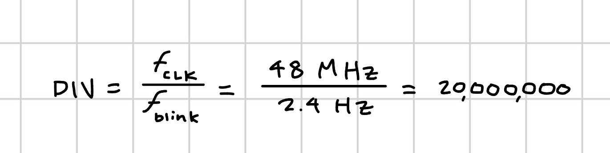

## Introduction
In this lab, a design was implemented on the FPGA to program a seven segment display, to show hexadecimal digits from 0 to F given a binary input. Two LEDs were also programmed with set logic given the input, and a third LED was programmed to blink at 2.4 Hz.

## Design and Testing Methodology
### Design Overview
The first step in the design was to determine the logic needed for the first two LEDs which resulted in a XOR gate and an AND gate. The third blinking LED utilized the on-board high-speed oscillator to generate a 48 MHz clock signal, then a counter was used at a cycle of 20000000 to generate a 2.4 Hz blinking frequency. 

The second part of the design included the 7 segment display decoder module that mapped the binary input to the segments of the display that needed to be illuminated to display the correct hexadecimal digit.

## Technical Documentation
The source code for the project can be found in the associated [Github repository](https://github.com/isabella-vera/E155/tree/main/Lab1)

### Block Diagram


### Schematic


### Resistor Caculations
To determine the appropriate resistor values, I used the forward voltage and current ratings from the 7-segment display datasheet. From the datasheet, I found that the voltage drop is typically 2.1 V, so with a 3.3 V supply voltage the resistor will have 1.2 V across it. To keep the current within the FPGA's and the display's constraints, I choose to use 150 ohm resistors which gives a current of 8 mA. This is well within the range.

### Blink Frequency Calculations
The blink LED (`led2`) is driven by `blinkCounter`, clocked by the FPGA's
internal `HSOSC` oscillator at $f_{clk} = 48\text{ MHz}$. The counter
increments once per clock cycle and toggles `led2` every time it reaches
`DIV - 1` cycles. I calculated the value of `DIV` to achieve a blink frequency of 2.4 Hz as follows:


## Results and Discussion
### Testbench Simulation


Figure 3 shows the waveforms generated from the testbench simulation of the top module. The waveforms show that the design is functioning as expected. The first two LEDs are illuminated based on the input. The seven segment display is also functioning as expected, displaying the correct hexadecimal digit based on the binary input. 

By running looking at the top module testbench waveforms, we can confirm that each of the modules is connected properly and functioning as expected as the top modules passes inputs into each module and demonstrates the expected behavior.


The third LED (led[2]) can be seen blinking at the correct frequency of 2.4 Hz in Figure 4, as the waveforms in Figure 3 were not run for long enough to observe the full blinking cycle. 

### Discussion
While all prescribed tasks were completed successfully, there was one issue with the hardware of the 7-segment display. The logic for the 7-segment display was correct, and the display was able to show all hexadecimal digits from 0x0 through 0xF, but the display was extremely dim. This was due to the 3.3V pin on the breadboard adapter dropping to 1.5-1.6V when connected to the display. Further work should be done to improve the brightness of the display.

## Conclusion
The design successfully blinked one LED at a frequency of 2.4 Hz using the on-board high-speed oscillator and demonstrated the correct logic for the other two LEDS. Additionally, the 7-segment display was succesfully driven by a combinational logic decoder and displayed all sixteen hexadecimal digits from 0x0 through 0xF. I spent about twenty hours working on this lab.

## AI Prototype Summary


I used ChatGPT to generate SystemVerilog for the 2 Hz blink prompt. The code it produced:

```systemverilog
module top (
    output logic led
);

    // Internal high-speed oscillator
    logic clk;

    // 22 bits is enough to count to 2,999,999
    logic [21:0] counter = '0;

    // UP5K HFOSC:
    // 2'b00 = 48 MHz
    // 2'b01 = 24 MHz
    // 2'b10 = 12 MHz
    // 2'b11 =  6 MHz
    SB_HFOSC #(
        .CLKHF_DIV("0b10")       // 12 MHz
    ) hfosc (
        .CLKHFPU(1'b1),          // Power up oscillator
        .CLKHFEN(1'b1),          // Enable oscillator
        .CLKHF  (clk)
    );

    // Divide 12 MHz down to a 2 Hz square wave.
    // Toggle LED every 3,000,000 clock cycles:
    //     12 MHz / (3,000,000 * 2) = 2 Hz
    always_ff @(posedge clk) begin
        if (counter == 22'd2_999_999) begin
            counter <= '0;
            led     <= ~led;
        end
        else begin
            counter <= counter + 1'b1;
        end
    end

endmodule
```

**Quality of the output.** On a read-through, this looked like solid, idiomatic SystemVerilog. It used `logic` consistently instead of `wire`/`reg` as the prompt asked, kept the counter and toggle logic in a single `always_ff` block, and sized the counter width sensibly (`[21:0]` comfortably covers the needed count without being wastefully wide). It also made a deliberate design choice I hadn't asked for: instead of using the oscillator's default 48 MHz output, it selected the 12 MHz divide setting on `SB_HFOSC` and explained why in a comment, which kept the required counter smaller. The math in the comments checks out — 12 MHz / (3,000,000 × 2) = 2 Hz.

**New syntax/constructs.** <!-- TODO: personalize -- e.g. was SB_HFOSC's CLKHF_DIV parameter or the string-literal parameter syntax ("0b10") new to you? Had you seen `'0` used as a fill literal before? -->

**Did it synthesize on the first try?** <!-- TODO: fill in after running it in Radiant. If yes, note that plainly. If not, paste the actual error/warning text Radiant gave you, and what you fed back into ChatGPT to resolve it, and whether that fix worked. -->

**Radiant output.** <!-- TODO: paste actual errors/warnings here, spoilered if long. If none, say so. -->

**What I'd do differently next time.** <!-- TODO: this one's worth answering honestly once you've seen the real outcome. If it worked cleanly first try, is there anything you'd still double check by hand rather than trusting blindly (reset behavior of `led` before its first assignment, pin constraints, timing)? If it didn't work first try, what would you prompt differently up front to avoid the back-and-forth? -->

Overall, my initial impression from reading the code (before running it) is that it's a reasonable attempt — clean style, correct-looking timing math, and appropriate use of the vendor primitive. The one thing I'd flag as worth checking in Radiant specifically is `led`'s initial state: it's declared as an output `logic` with no explicit reset in the `always_ff` block, so its power-on-reset value depends on how the toolchain initializes flip-flops from the bitstream rather than being explicitly defined in the RTL.
