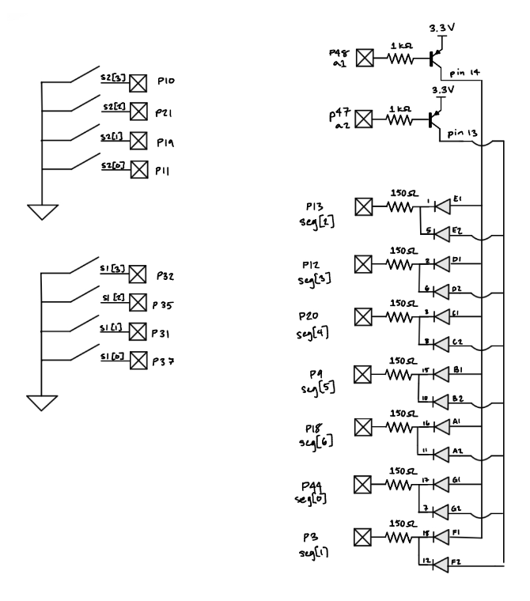
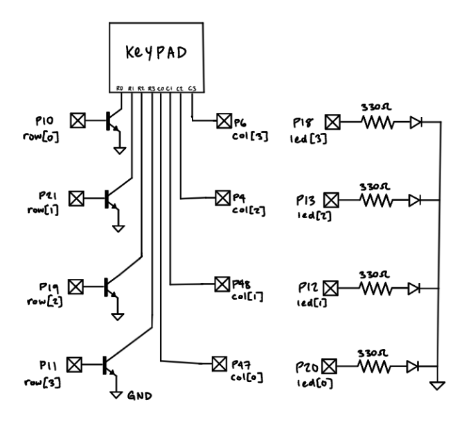
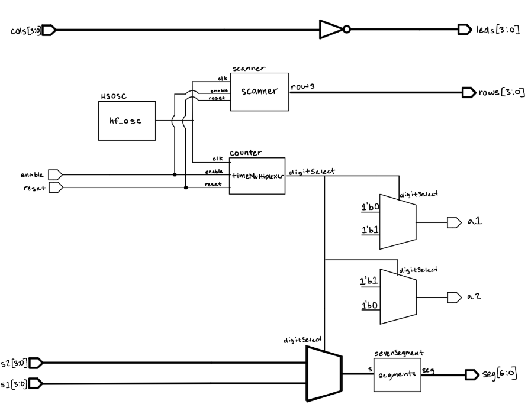
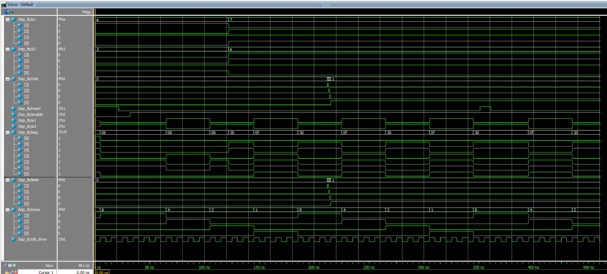
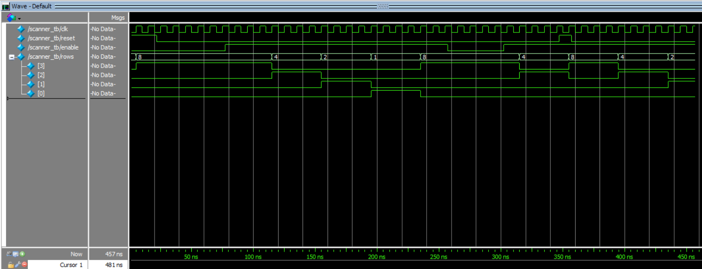

## Introduction
This lab can be split into two main parts. First, I designed a system to time multiplex a dual seven-segment display to show a 2-digit hexadecimal number. The second part of the lab was to design a keypad scanner that blinks an LED based on the column of the currently pressed key.

## Design and Testing Methodology
### Frequency Calculations
For the first step of the design, the time multiplexing of the dual seven-segment display, I started with the seven segment decoder module I developed in the previous lab. I then had to find the correct frequency to multiplex the two displays. I looked online for what frequency the human eye can perceive as a constant light and found that it is around 60 Hz. I then decided to use a frequency of 120 Hz to multiplex the two displays to ensure there was no visible flicker. To achieve this frequency I used the on-board high-speed oscillator to generate a 48 MHz clock signal, then a counter was used with a max count of 200000 to generate a 120 Hz multiplexing frequency. My math to get the maximum count of 200000 is as follows:
$maxCount = \frac{48\text{ MHz}}{2 \times 120\text{ Hz}} = 200,000$

Similar math was done to achieve the proper frequency for the keypad scanner. I wanted all 4 columns to be illuminated once within 0.5s. In other words, each LED should be on for 0.125 s in the scan pattern and the full scan pattern should complete twice within 1 second. In other words, you are scanning the full keypad twice per second (2 Hz).
$maxCount = {48\text{ MHz}} {\times 0.125\text{ s}} = 6,000,000$

### Hardware Design
The pinout schematic for the time-multiplexed dual seven-segment display is shown  below. 2N3906 PNP transistors were used to drive the common anode of each display. The cathodes of the displays are connected to the FPGA pins through 150 ohm resistors. 



The schematic for the keypad scanner is also shown below. The rows of the keypad are connected to the FPGA pins through 2N3904 NPN transistors, and the columns of the keypad are connected to the FPGA pins directly. Internal 100k ohm pull-up resistors are used on the column pins. The LEDs areconnected to the FPGA pin through 330 ohm resistors.


## Technical Documentation
The source code for the project can be found in the associated [Github repository](https://github.com/isabella-vera/E155/tree/main/Lab%202)

### Block Diagram


## Results and Discussion
### Testbench Simulation





Above are the waveforms generated from each testbench simulation. Each module had its own test bench. Since the counter and sevenSegment modules came from the previous lab, they were not tested again. The top module test bench was used to test the entire design. The scanner test bench was used to test the keypad scanner module. The waveforms show that the design is functioning as expected.


### Discussion
All prescribed tasks were completed successfully.

## Conclusion
The design successfully displayed hexadecimal values on a dual seven-segment display by time multiplexing at a 120 Hz frequency. Additionally, the keypad scanner was able to scan the keypad at a frequency of 2 Hz and blink an LED based on the column of the currently pressed key.

I spent about twenty hours working on this lab.

## AI Prototype Summary
When given the first prompt, Copilot generated the following:
```
module seven_seg_decoder (
    input  logic [3:0] bin,
    output logic [6:0] seg   // {a,b,c,d,e,f,g}, active-low
);
    always_comb begin
        case (bin)
            4'h0: seg = 7'b0000001;
            4'h1: seg = 7'b1001111;
            4'h2: seg = 7'b0010010;
            4'h3: seg = 7'b0000110;
            4'h4: seg = 7'b1001100;
            4'h5: seg = 7'b0100100;
            4'h6: seg = 7'b0100000;
            4'h7: seg = 7'b0001111;
            4'h8: seg = 7'b0000000;
            4'h9: seg = 7'b0000100;
            4'hA: seg = 7'b0001000;
            4'hB: seg = 7'b1100000;
            4'hC: seg = 7'b0110001;
            4'hD: seg = 7'b1000010;
            4'hE: seg = 7'b0110000;
            4'hF: seg = 7'b0111000;
            default: seg = 7'b1111111; // all off
        endcase
    end
endmodule

module seven_seg_mux2 (
    input  logic        clk,
    input  logic        rst_n,

    input  logic [3:0]  digit0,   // first nibble
    input  logic [3:0]  digit1,   // second nibble

    output logic [6:0]  seg,      // shared segment lines (active-low)
    output logic [1:0]  an        // anode enables (active-low)
);

    // ------------------------------------------------------------
    // Clock divider for multiplexing (adjust DIV for refresh rate)
    // ------------------------------------------------------------
    localparam int DIV = 50000;   // ~1 kHz at 50 MHz clock
    logic [$clog2(DIV)-1:0] cnt;
    logic mux_sel;

    always_ff @(posedge clk or negedge rst_n) begin
        if (!rst_n) begin
            cnt     <= '0;
            mux_sel <= 1'b0;
        end else begin
            if (cnt == DIV-1) begin
                cnt     <= '0;
                mux_sel <= ~mux_sel;   // toggle between digit0 and digit1
            end else begin
                cnt <= cnt + 1;
            end
        end
    end

    // ------------------------------------------------------------
    // Select which digit to decode
    // ------------------------------------------------------------
    logic [3:0] active_digit;

    always_comb begin
        case (mux_sel)
            1'b0: begin
                active_digit = digit0;
                an = 2'b10;   // enable digit0 (active-low)
            end
            1'b1: begin
                active_digit = digit1;
                an = 2'b01;   // enable digit1 (active-low)
            end
        endcase
    end

    // ------------------------------------------------------------
    // Shared decoder instance
    // ------------------------------------------------------------
    seven_seg_decoder dec_inst (
        .bin(active_digit),
        .seg(seg)
    );

endmodule
```
It compiled successfully. Scanning through the code I believe it would work, it just probably wouldn't meet lab specifications. I then used ChatGPT to upload my lab 1 code and the second given prompt. The code it produced:
```
// Isabella Vera
// E155 Lab 1
// Time-multiplexed seven-segment display

module top (
    input  logic [3:0] s0,
    input  logic [3:0] s1,
    input  logic reset,

    output logic [6:0] seg0,
    output logic [6:0] seg1
);

    // Internal high-speed oscillator
    logic int_osc;
    HSOSC hf_osc (
        .CLKHFPU(1'b1),
        .CLKHFEN(1'b1),
        .CLKHF(int_osc)
    );

    // Counter used to slow down the multiplexing
    logic [15:0] count;

    always_ff @(posedge int_osc or posedge reset) begin
        if (reset)
            count <= 16'b0;
        else
            count <= count + 1'b1;
    end

    // Select between the two input digits
    logic [3:0] selected_input;

    assign selected_input = count[15] ? s1 : s0;

    // Output of the single seven-segment decoder
    logic [6:0] decoded_seg;

    // Use one decoder for both displays
    sevenSegDecoder decoder (
        .s(selected_input),
        .seg(decoded_seg)
    );

    // Time multiplex the decoder output
    // Outputs are active-low because the display is common-anode.
    always_comb begin
        if (count[15]) begin
            seg0 = 7'b1111111;  // display 0 off
            seg1 = decoded_seg;  // display 1 on
        end
        else begin
            seg0 = decoded_seg;  // display 0 on
            seg1 = 7'b1111111;  // display 1 off
        end
    end

endmodule
```

I found it interesting that the code generated by ChatGPT was very similar to my own code from lab 1. I was surprised that it even generated my name and information in the top comment. This code also compileds successfully. I believe both designs would work, but the ChatGPT design is more efficient in terms of using modules I already developed, something I implemented in lab this week.